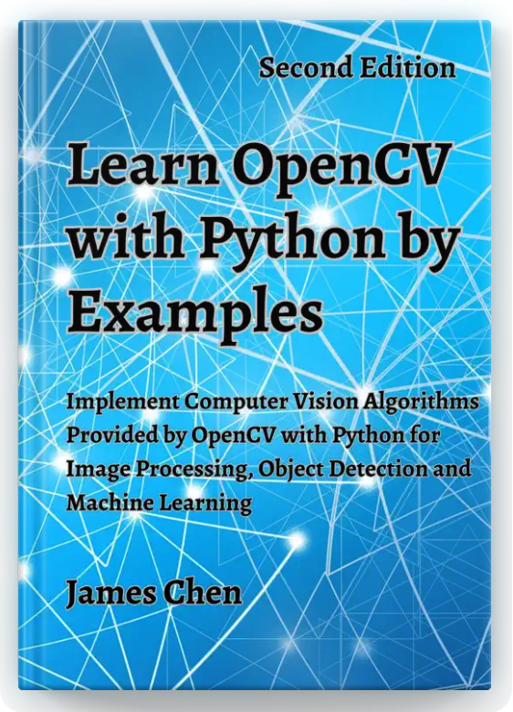

# Learn OpenCV with Python by Examples

This repository contains the source code and accompanying materials for the book "Learn OpenCV with Python by Examples" by James Chen. This book is a comprehensive guide to learning the basics of computer vision and machine learning using the powerful OpenCV library and the Python programming language. It offers a practical, hands-on approach to learn the concepts and techniques of computer vision through practical examples.

<picture>
  
</picture>

**Title: Learn OpenCV with Python by Examples**

**Subtitle: Implement Computer Vision Algorithms Provided by OpenCV with Python for Image Processing, Object Detection and Machine Learning**

**Author: James Chen (LinkedIn: [linkedin.com/in/jchen8000](https://www.linkedin.com/in/jchen8000/))**

Available at:

ISBN: 978-1-7389084-5-5 (eBook), [Amazon Kindle](https://www.amazon.com/dp/B0BZQGMTYW), [Apple Books](http://books.apple.com/us/book/id6450611152), 
[Google Play Books](https://play.google.com/store/books/details?id=qzDCEAAAQBAJ), [Rakuten Kobo](https://www.kobo.com/ca/en/search?q=9781738908455), 

ISBN: 978-1-7389084-3-1 (Paperback), [Amazon](https://www.amazon.com/dp/1738908437)

ISBN: 978-1-7389084-4-8 (Hardcover), [Amazon](https://www.amazon.com/Learn-OpenCV-Python-Examples-Algorithms/dp/1738908445)

## Book Overview

Through a series of examples, the book covers a wide range of topics including image and video processing, feature detection, object detection and recognition, machine learning and deep neural networks. Each chapter includes detailed explanations of the concepts and techniques involved, as well as practical examples and code snippets that demonstrate how to implement them in Python. Throughout the book, readers will work through hands-on examples and projects, learning how to build image processing applications from scratch.

Whether you are a beginner or an experienced programmer, this book provides a valuable resource for learning computer vision with OpenCV and Python. The clear and concise writing style makes it easy for readers to follow along, and the numerous examples ensure that readers can practice and apply what they have learned. By the end of the book, readers will have a solid understanding of the fundamentals of computer vision and be able to build their own computer vision applications with confidence. This book is an excellent resource for anyone looking to learn computer vision and machine learning using the OpenCV library and Python programming language.

## Source Code

The source codes are organized in the folders corresponding to the the chapters of the book.

Refer to the book for guidance on using the code examples.

## License

The contents of this repository are licensed under the MIT License. See the LICENSE file for more details.

## Contact

If you have any questions or suggestions regarding the book or the repository, please feel free to reach out to the author at [linkedin.com/in/jchen8000](https://www.linkedin.com/in/jchen8000/).

